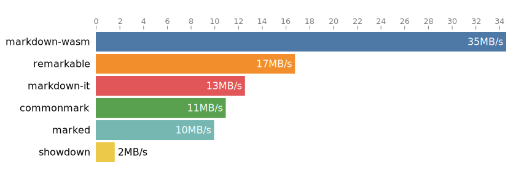

# markdown-wasm

Very fast Markdown parser & HTML renderer implemented in WebAssembly

- Zero dependencies (31 kB gzipped)
- Portable & safe (WASM executes in isolated memory and can run almost anywhere)
- [Simple API](#api)
- [Very fast](#benchmarks)
- Based on [md4c](http://github.com/mity/md4c) — compliant to the CommonMark specification


## Examples

In NodeJS, single file with embedded compressed WASM

```js
const markdown = require("./dist/markdown.node.js")
console.log(markdown.parse("# hello\n*world*"))
```

ES module with WASM loaded separately

```js
import * as markdown from "./dist/markdown.es.js"
await markdown.ready
console.log(markdown.parse("# hello\n*world*"))
```

Web browser

```html
<script src="markdown.js"></script>
<script>
window["markdown"].ready.then(markdown => {
  console.log(markdown.parse("# hello\n*world*"))
})
</script>
```


## Install

```
npm install markdown-wasm
```


## Benchmarks

The [`test/benchmark`](test/benchmark) directory contain a benchmark suite which you can
run yourself. It tests a few popular markdown parser-renderers by parsing & rendering a bunch
of different sample markdown files.

The following results were samples on a 2.9 GHz MacBook running macOS 10.15, NodeJS v14.11.0


#### Average ops/second

Ops/second represents how many times a library is able to parse markdown and render HTML
during a second, on average across all sample files.


#### Average throughput

Throughput is the average amount of markdown data processed during a second while both parsing
and rendering to HTML. The statistics does not include HTML generated but only bytes of markdown
source text parsed.




#### Min–max parse time

This graph shows the spread between the fastest and slowest parse-and-render operations
for each library. Lower numbers are better.


See [`test/benchmark`](test/benchmark#readme) for more information.


## API

```ts
/**
 * parse reads markdown source at s and converts it to HTML.
 * When output is a byte array, it will be a reference.
 */
export function parse(s :Source, o? :ParseOptions & { bytes? :never|false }) :string
export function parse(s :Source, o? :ParseOptions & { bytes :true }) :Uint8Array

/** Markdown source code can be provided as a JavaScript string or UTF8 encoded data */
type Source = string | ArrayLike<number>

/** Options for the parse function */
export interface ParseOptions {
  /** Customize parsing. Defaults to ParseFlags.DEFAULT */
  parseFlags? :ParseFlags

  /** Select output format. Defaults to "html" */
  format? : "html" | "xhtml"

  /**
   * bytes=true causes parse() to return the result as a Uint8Array instead of a string.
   *
   * The returned Uint8Array is only valid until the next call to parse().
   * If you need to keep the returned data around, call Uint8Array.slice() to make a copy,
   * as each call to parse() uses the same underlying memory.
   *
   * This only provides a performance benefit when you never need to convert the output
   * to a string. In most cases you're better off leaving this unset or false.
   */
  bytes? :boolean

  /** Allow "javascript:" in links */
  allowJSURIs? :boolean

  /**
   * Optional callback which if provided is called for each code block.
   * langname holds the "language tag", if any, of the block.
   *
   * The returned value is inserted into the resulting HTML verbatim, without HTML escaping.
   * Thus, you should take care of properly escaping any special HTML characters.
   *
   * If the function returns null or undefined, or an exception occurs, the body will be
   * included as-is after going through HTML escaping.
   *
   * Note that use of this callback has an adverse impact on performance as it casues
   * calls and data to be bridged between WASM and JS on every invocation.
   */
  onCodeBlock? :(langname :string, body :UTF8Bytes) => Uint8Array|string|null|undefined

  /** @depreceated use "bytes" instead (v1.1.1) */
  asMemoryView? :boolean
}

/** UTF8Bytes is a Uint8Array representing UTF8 text  */
export interface UTF8Bytes extends Uint8Array {
  /** toString returns a UTF8 decoded string (lazily decoded and cached) */
  toString() :string
}

/** Flags that customize Markdown parsing */
export enum ParseFlags {
  /** In TEXT, collapse non-trivial whitespace into single ' ' */ COLLAPSE_WHITESPACE,
  /** Enable $ and $$ containing LaTeX equations. */              LATEX_MATH_SPANS,
  /** Disable raw HTML blocks. */                                 NO_HTML_BLOCKS,
  /** Disable raw HTML (inline). */                               NO_HTML_SPANS,
  /** Disable indented code blocks. (Only fenced code works.) */  NO_INDENTED_CODE_BLOCKS,
  /** Do not require space in ATX headers ( ###header ) */        PERMISSIVE_ATX_HEADERS,
  /** Recognize e-mails as links even without <...> */            PERMISSIVE_EMAIL_AUTO_LINKS,
  /** Recognize URLs as links even without <...> */               PERMISSIVE_URL_AUTO_LINKS,
  /** Enable WWW autolinks (without proto; just 'www.') */        PERMISSIVE_WWW_AUTOLINKS,
  /** Enable strikethrough extension. */                          STRIKETHROUGH,
  /** Enable tables extension. */                                 TABLES,
  /** Enable task list extension. */                              TASK_LISTS,
  /** Enable wiki links extension. */                             WIKI_LINKS,
  /** Enable underline extension (disables '_' for emphasis) */   UNDERLINE,

  /** Default flags are:
   *    COLLAPSE_WHITESPACE |
   *    PERMISSIVE_ATX_HEADERS |
   *    PERMISSIVE_URL_AUTO_LINKS |
   *    STRIKETHROUGH |
   *    TABLES |
   *    TASK_LISTS
   */
  DEFAULT,

  /** Shorthand for NO_HTML_BLOCKS | NO_HTML_SPANS */
  NO_HTML,
}
```

See [`markdown.d.ts`](markdown.d.ts)


## Building from source

```
npm install
npx wasmc
```

Build debug version of markdown into ./build/debug and watch source files:

```
npx wasmc -g -w
```

If you need special builds, like for example an ES module with embedded WASM,
edit the `wasmc.js` file and add `module({...})` directives.

Example:

```js
module({ ...m,
  name:   "markdown-custom",
  out:    outdir + "/markdown.custom.js",
  embed:  true,
  format: "es",
})
```
